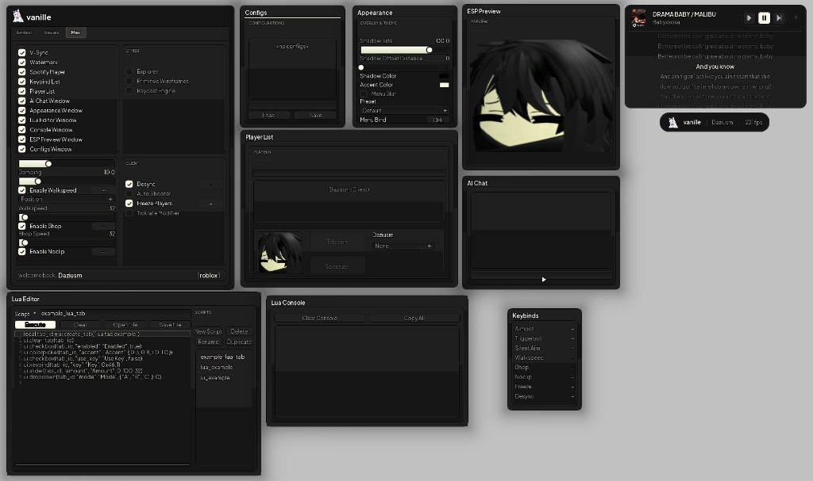

<p align="center">
  
</p>

<h1 align="center">vanille</h1>

<p align="center">
  <strong>Modular Roblox external overlay with a polished ImGui UI, Lua scripting, and a built-in loader.</strong><br />
  Aimbot, visuals, movement, player tools, theme engine, Spotify widget, and a sandboxed Lua VM — all in detachable windows.
</p>

<p align="center">
  <a href="LICENSE"></a>
  <a href="#build"></a>
  <a href="docs/LUA_VM.md"></a>
</p>

<p align="center">
  <a href="#features">Features</a> ·
  <a href="#screenshots">Screenshots</a> ·
  <a href="#build">Build</a> ·
  <a href="#project-structure">Structure</a> ·
  <a href="docs/LUA_VM.md">Lua API</a>
</p>

---

<p align="center">
  
</p>

<p align="center"><em>Modular overlay — detach any panel, customize theme and accent, script with Lua, manage configs.</em></p>

---

## Why vanille?

Most externals ship a single cramped menu. Vanille treats the overlay as a **desktop** — every panel is optional, draggable, and themed:

- **Combat & visuals** — aimbot, silent aim, triggerbot, ESP preview, lighting, target HUD
- **Movement & world** — walkspeed, bhop, noclip, explorer, raycast engine, primitive wireframes
- **Player tools** — player list with teleport/spectate, keybind overlay, watermark
- **Lua runtime** — in-process editor, console, `Drawing` API, and UI bindings (`ui.create_tab`, checkboxes, color pickers)
- **Quality-of-life** — config profiles, appearance engine (shadows, accent), Spotify player, AI chat window
- **Loader** — WinForms launcher that stages the payload, injects into Roblox, and can pull sources from this repo

---

## Features

| Area | What you get |
|------|----------------|
| **Modular UI** | Detachable windows: menu, Lua editor, console, ESP preview, player list, configs, appearance, keybinds, Spotify, AI chat |
| **Combat** | Aimbot, silent aim, triggerbot, free aim, auto shooter, target HUD |
| **Visuals** | ESP, lighting controls, primitive wireframes, ESP preview window |
| **Movement** | Walkspeed, bhop, noclip, damping, arm modifier |
| **Client** | Desync, tickrate modifier, freeze players, explorer, raycast engine |
| **Lua VM** | Sandboxed Lua 5.3, `Drawing` objects, mirrored `game`/`workspace` tree, script storage |
| **Theme** | Shadow size/offset/color, accent picker, menu bind (default `DEL`) |
| **Configs** | Save/load profiles from the configs window |
| **Loader** | `ChocolaLoader` — payload zip staging, GitHub source install, Roblox process detection |

---

## Screenshots

The hero image above shows the full modular layout. Individual panels:

| Panel | Description |
|-------|-------------|
| **Menu** | Aimbot · Visuals · Misc tabs with movement, client, and window toggles |
| **Lua Editor** | Multi-script sidebar, execute/clear, open/save `.lua` files |
| **ESP Preview** | Live character preview for overlay tuning |
| **Appearance** | Overlay & theme — shadows, accent color, menu bind |
| **Player List** | In-game players with teleport and spectate actions |

---

## Build

**Requirements:** Windows 10/11 x64, Visual Studio 2022 (C++ desktop + .NET desktop), CMake 3.20+ (loader).

### Quick start

```powershell
git clone https://github.com/Daziusm/vanille.git
cd vanille
```

### 1. Provide `values.txt`

Vanille reads a `values.txt` offset map at runtime. **This file is not included in the repository** — you must supply your own and place it in `Vanille/build/` next to `vanille.exe` after building. The format is a simple key/value list consumed by `LoadOffsets()` in the client.

### 2. Build Vanille (overlay)

```powershell
cd Vanille
# Open vanille.sln in Visual Studio → Release | x64 → Build
# Or:
msbuild vanille.sln /p:Configuration=Release /p:Platform=x64
```

Output: `Vanille/build/vanille.exe` (plus `fonts/`, `values.txt`, and `lua53-64.dll` beside the exe).

Build `lua53-64.dll` from `third_party/lua` or place a locally built copy in `build/`.

### 3. Build loader

```powershell
cd loader
.\build-chocola.ps1
```

Stages `vanille.exe` into a payload zip, builds `ChocolaLoader`, and copies `Vanille.exe` to `loader/dist/`. Requires a successful Vanille Release build first.

### 4. Run

Launch `loader/dist/Vanille.exe` (or `ChocolaLoader\bin\Release\Vanille.exe` after a local build). The loader detects Roblox, injects the staged payload, and can download fresh sources from [github.com/Daziusm/vanille](https://github.com/Daziusm/vanille) via **Install sources** in the UI.

---

## Project structure

```
vanille/                    # repo root
├── Vanille/                # C++ overlay client (ImGui, D3D11, features, Lua VM)
│   ├── source/             # entry, gui, features, lua, sdk, memory
│   ├── extern/             # imgui, freetype, clipper2, text editor, …
│   ├── assets/             # logo, splash, icons
│   ├── fonts/              # Plus Jakarta Sans (OFL)
│   ├── docs/               # Lua VM reference, brand/logo guide
│   └── scripts/            # png_to_logo_c.py, example Lua scripts
├── loader/                 # Chocola WinForms loader + CMake native path
│   ├── ChocolaLoader/      # C# UI, injection, payload service
│   └── cmake/              # stage_payload.cmake
├── examples/
│   └── lua/                # Example scripts (ui_example, lua_example, …)
└── docs/
    └── images/             # Screenshots for README
```

---

## Documentation

| Guide | Contents |
|-------|----------|
| [docs/LUA_VM.md](Vanille/docs/LUA_VM.md) | Lua API — `ui`, `Drawing`, services, sandbox rules |
| [docs/BRAND_LOGO.md](Vanille/docs/BRAND_LOGO.md) | Replace the menu logo via `png_to_logo_c.py` |

---

## Disclaimer

**Educational and personal use only.** vanille interacts with the Roblox client via external memory techniques. Using it on live games may violate [Roblox Terms of Use](https://en.help.roblox.com/hc/en-us/articles/203313410) and risks account action. The authors are **not affiliated with Roblox Corporation**. Use at your own risk.

This repository ships **source code only** — no prebuilt binaries, embedded payloads, offset files, or license keys.

---

## License

[MIT License](LICENSE). Copyright (c) 2026 Daziusm.

Third-party components retain their own licenses (ImGui, FreeType, Lua, Plus Jakarta Sans OFL, etc.).
